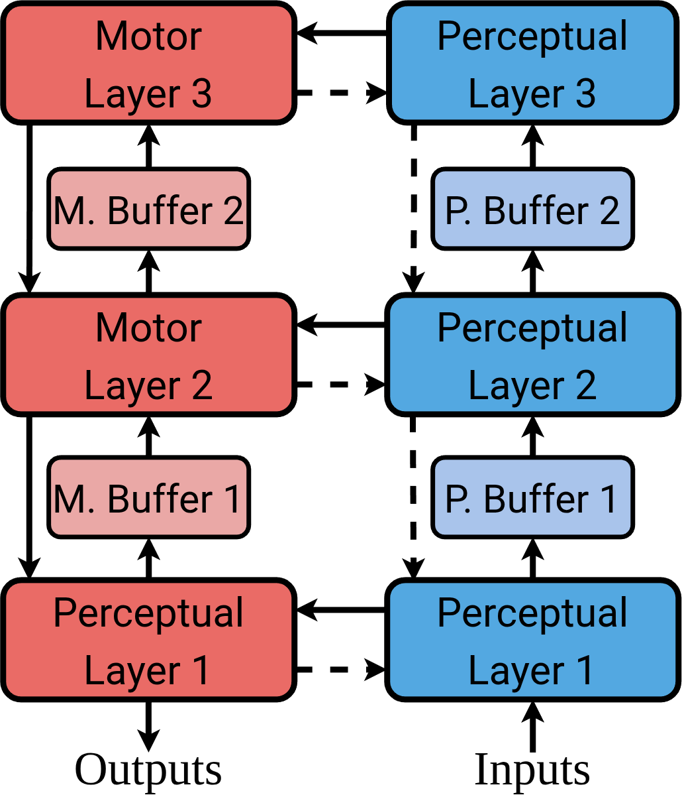
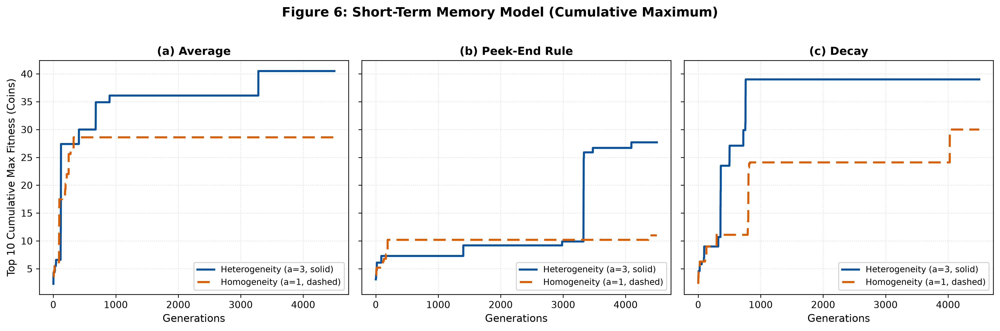
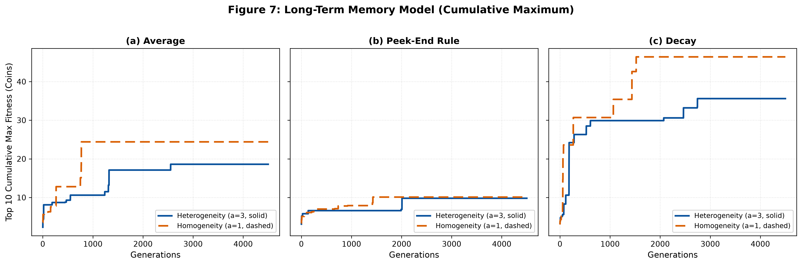

# Temporal Heterogeneity in Cognitive Architectures

[](https://www.python.org/downloads/)
[](https://github.com/astral-sh/uv)
[](https://github.com/astral-sh/ruff)
[](https://mypy-lang.org/)

Unofficial reproduction of the paper:  
> **Sandoval-Arrayga, C. J., Palacios-Ramirez, G., & Ramos-Corchado, F. F. (2024).** *Temporal heterogeneity in cognitive architectures*. **Cognitive Systems Research**, 88, 101265. [DOI: 10.1016/j.cogsys.2024.101265](https://doi.org/10.1016/j.cogsys.2024.101265)

This project simulates bio-inspired cognitive agents in a 2D foraging environment to investigate whether operating at distinct temporal scales (**temporal heterogeneity**) optimizes synaptic learning (Sanger's GHA), survival, and energetic efficiency compared to synchronous (**homogeneous**) processing.

> ⚠️ **Paper Errata & Reproduction Decisions:** See [`typos.md`](typos.md) for detailed mathematical corrections to the original publication and reproduction assumptions.

---

## 🧠 Cognitive Architecture

<p align="center">
<picture>
   
</picture>
</p>

* **Sensorimotor Hierarchy:** 3 perceptual layers ($P_1, P_2, P_3$) and 3 motor layers ($M_3, M_2, M_1$).
* **Temporal Activation Modes:**
  * **Heterogeneous ($a = 3$):** Lower layers execute at three times the rate of higher-order deliberative layers.
  * **Homogeneous ($a = 1$):** All layers execute synchronously at each time step.
* **Memory Buffers:** Temporal condensation via `average`, `decay` (exponential decay), or `peek_end` (most recent state).
* **Memory Regimes:** Short-term memory (`short_term`) and long-term memory (`long_term`).
* **Embodied Cognition (4E):** Energetic costs for movement ($0.5\%$) and thinking ($0.0833\%$ per active layer), directly coupled to survival and evolutionary selection.

---

## 📊 Simulation Results (`cummax`)

Evolution of the **cumulative maximum ($\text{cummax}$)** of mean fitness (Top 10 agents), smoothing out inter-generational variance across **4,500 generations**.

### Short-Term Memory Regime


### Long-Term Memory Regime


### Performance Summary (Top Fitness Achieved)

| Regime | Buffer | Heterogeneous ($a=3$) | Homogeneous ($a=1$) | Advantage |
|---|---|:---:|:---:|:---:|
| **Short-Term** | `average` | **40.50** | 28.60 | 🚀 Heterogeneous (+41.6%) |
| **Short-Term** | `decay` | **39.00** | 30.00 | 🚀 Heterogeneous (+30.0%) |
| **Short-Term** | `peek_end` | **27.70** | 11.00 | 🚀 Heterogeneous (+151.8%) |
| **Long-Term** | `average` | 18.60 | **24.40** | Homogeneous |
| **Long-Term** | `decay` | 35.60 | **46.40** | Homogeneous |
| **Long-Term** | `peek_end` | 9.80 | **10.10** | Homogeneous |

---

## ⏱️ Hardware & Execution Time

Full experiment executed using [`configs/config.yaml`](configs/config.yaml) (**12 parallel runs**, 4,500 generations, 100 agents population, 10,000 max steps per agent lifespan):

| Component | Specification |
|---|---|
| **CPU** | AMD Ryzen 7 5700 (8 cores / 16 threads, up to 4.65 GHz) |
| **RAM** | 16 GB DDR4 |
| **Operating System** | Ubuntu 24.04 LTS (Linux x86_64) |
| **Parallel Workers** | 6 workers (`simulation.max_workers: 6`) |
| **Total Execution Time** | **38,297.0 s** (~**10 h 38 min 17 s** / ~10.64 hours) |
| **Per-Run Duration** | 4.1 to 5.8 hours per experiment |

---

## 🚀 Installation & Reproduction

### 1. Clone the Repository

```bash
git clone https://github.com/PilotLeoYan/unofficial-temporal-heterogeneity-paper.git
cd unofficial-temporal-heterogeneity-paper
```

### 2. Environment & Dependencies

This project uses [**uv**](https://docs.astral.sh/uv/) for Python package and virtual environment management.

```bash
# Synchronize dependencies (installs Python and packages automatically)
uv sync
```

### 3. Run the Experiment

```bash
# Run all simulations configured in configs/config.yaml
make run

# Or directly with uv:
uv run python -m src
```

> **💡 Tip for long runs on Linux:**  
> Prevent the system from suspending during overnight execution:  
> ```bash
> systemd-inhibit --what=idle make run
> ```

### 4. Plot Figures Only

If simulation logs already exist in `results/runs/` and you only want to re-render Figures 6 and 7:

```bash
uv run python -m src --plot
```

### 5. Development Commands

```bash
make format    # Code formatting with Ruff
make lint      # Linting with Ruff and static type checking with Mypy
make check     # Full validation with Pre-commit
```

---

## 📂 Project Structure

```text
├── assets/                  # Architecture diagrams
├── configs/
│   └── config.yaml          # Simulation and evolution hyperparameters
├── notes/                   # Paper notes and terminal execution logs
├── results/
│   ├── figures/             # Generated paper plots (Figures 6 & 7)
│   ├── runs/                # JSONL run logs and generation metrics
│   └── experiments_index.csv# Experiment registry and final scores
├── src/
│   ├── components/          # Environment, memory buffers, layers, and agents
│   ├── config/              # Pydantic schema and YAML loader
│   └── simulation/          # Evolutionary loop, multiprocessing, and plotting
├── tests/                   # Unit tests
├── typos.md                 # Paper errata and reproduction rationale
└── Makefile                 # Build and run shortcuts
```

---

## 📄 Citation

```bibtex
@article{sandoval2024temporal,
  title={Temporal heterogeneity in cognitive architectures},
  author={Sandoval-Arrayga, Carlos J and Palacios-Ramirez, German and Ramos-Corchado, Fernando F},
  journal={Cognitive Systems Research},
  volume={88},
  pages={101265},
  year={2024},
  publisher={Elsevier},
  doi={10.1016/j.cogsys.2024.101265}
}
```
